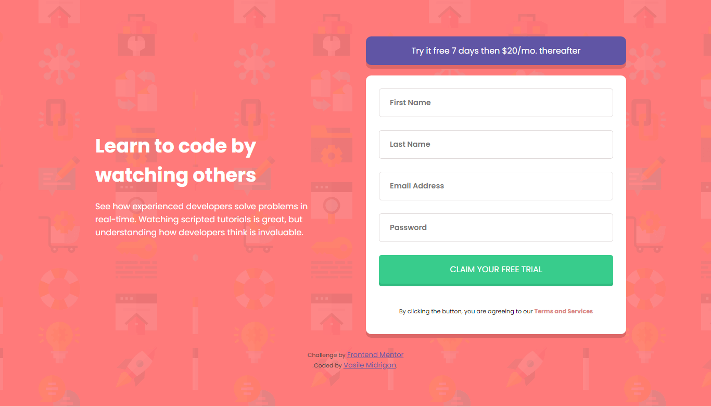
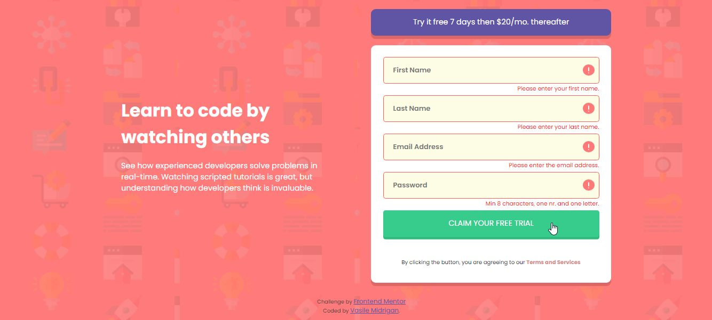
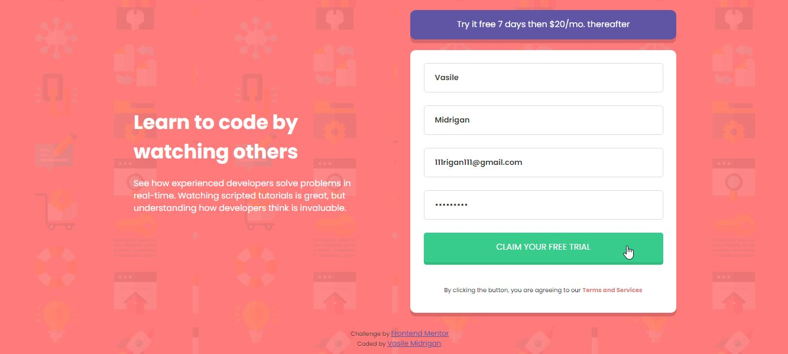
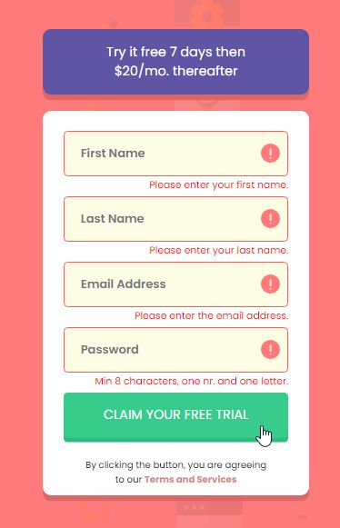
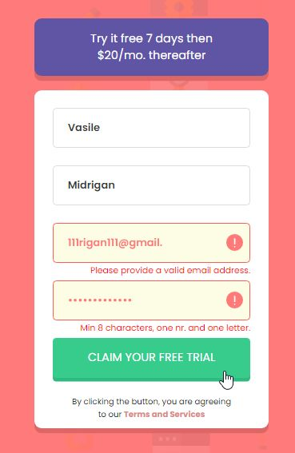

# Frontend Mentor - Intro component with sign up form solution

This is a solution to the [Intro component with sign up form challenge on Frontend Mentor](https://www.frontendmentor.io/challenges/intro-component-with-signup-form-5cf91bd49edda32581d28fd1). Frontend Mentor challenges help you improve your coding skills by building realistic projects.

## Table of contents

- [Overview](#overview)
  - [The challenge](#the-challenge)
  - [Screenshot](#screenshot)
  - [Links](#links)
- [My process](#my-process)
  - [Built with](#built-with)
  - [What I learned](#what-i-learned)
  - [Continued development](#continued-development)
  - [Useful resources](#useful-resources)
- [Author](#author)
- [Acknowledgments](#acknowledgments)

## Overview

### The challenge

Users should be able to:

- View the optimal layout for the site depending on their device's screen size
- See hover states for all interactive elements on the page
- Receive an error message when the `form` is submitted if:
  - Any `input` field is empty. The message for this error should say _"[Field Name] cannot be empty"_
  - The email address is not formatted correctly (i.e. a correct email address should have this structure: `name@host.tld`). The message for this error should say _"Looks like this is not an email"_

### Screenshots

Desktop Version

Desktop Version Error States

Desktop Version Pass Validation State

Mobile Version Error States

Mobile Version Email and Password Error States

### Links

- [Check the live version](https://vasilemidrigan.github.io/sign-up-form/)

## My process

### Built with

- Semantic HTML5 markup
- CSS custom properties
- Flexbox
- CSS Grid
- Mobile-first workflow
- JavaScript Form Validation
- JavaScript Event Listeners

## Author

- Website - [vasilemidrigan.github.io](https://vasilemidrigan.github.io/)
- Github - [vasilemidrigan](https://github.com/vasilemidrigan)
- LinkedIn - [Vasile Midrigan](https://www.linkedin.com/in/vasile-midrigan/)
- Frontend Mentor - [@vasilemidrigan](https://www.frontendmentor.io/profile/vasilemidrigan)

